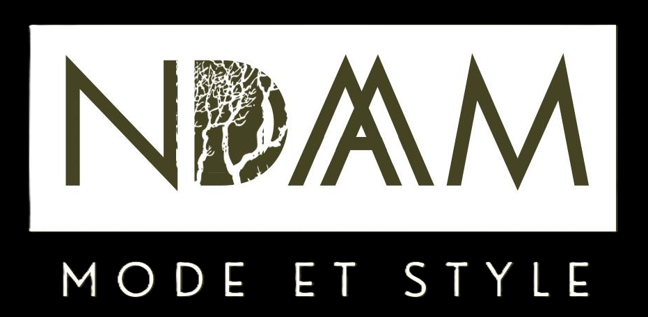

# NDAAM - African Elegance Reinvented



## 📱 African Fashion Mobile Application

NDAAM is a modern mobile application showcasing an elegant collection of African clothing

## 🎨 Design & Interface of the App

### **iOS 26 Liquid Glass Style**
- Navigation bar with liquid glass effect
- Smooth animations and modern transitions inspired by Zara's App
- Automatic color adaptation of the tab bar based on background
- Minimalist design inspired by Zara

### **Color Palette**
- **Dark background** : Elegant black (#000000)
- **Accents** : White and gray for contrast
- **Typography** : Custom "Candy Season" font


## 🛠️ Technologies Used

- **React Native** with JS
- **Expo**
- **NativeWind** for Tailwind CSS styling


## 📦 Installation & Setup

### **Prerequisites**
- Node.js (version 16 or higher)
- npm
- New Expo CLI (npx)


### **Installation**

1. **Clone the repository**
```bash
git clone https://github.com/toranogix/ndaam.git
cd ndaam
```

2. **Install dependencies**
```bash
npm install

```

3. **Install Expo dependencies**
```bash
npx expo install "dependencies"
```

4. **Start the application**
```bash
npx expo start
```

### **Font Configuration**
The application uses the custom "Candy Season" font. Make sure font files are properly configured in the `assets/fonts/` folder

## 📱 Project Structure

```
ndaam/
├── assets/                 # Images, fonts, resources
│   ├── man/               # Men's product images
│   ├── women/             # Women's product images
│   └── fonts/             # Custom fonts
├── src/
│   ├── context/           # Context API (BasketContext)
│   ├── data/              # Product data (catalogue.js)
│   └── screens/           # Application screens
│       ├── homeScreen.js
│       ├── searchScreen.js
│       ├── catalogueScreen.js
│       ├── basketScreen.js
│       ├── profileScreen.js
│       └── productDetails.js
├── App.js                 # Main configuration
├── package.json
└── README.md
```


## 🎯 Upcoming Features

- [ ] Authentication system
- [V] Favorites management
- [ ] Payment system
- [ ] Push notifications
- [ ] Offline mode
- [ ] Social media sharing

## 🤝 Contributing
Feel free to fork the projet and share some suggestions !
s
## 📄 License

This project is licensed under the MIT License. See the `LICENSE` file for details.

## 📞 Contact

For any questions about the NDAAM application:

- **Email** : codiallo17@gmail.com / ousmanelo998@gmail.com

---

**NDAAM** - African Elegance Reinvented ✨ 
